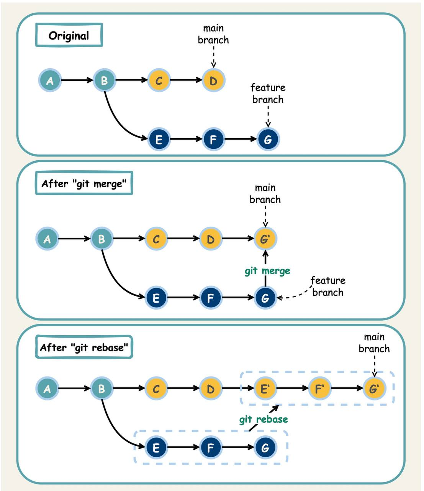

# Contributing to the Codebase 🚀

This document shares some best practices and tips for working on our code base.

## Commit Message 📝
Write a good commit message that follows this format:

---
```
[optional emoji] [type]([optional scope]): [subject]
[BLANK LINE]
[optional body]
```
---
Where:

- `[optional emoji]` is an optional emoji that represents the type of change. You can use https://gitmoji.dev/ to find
suitable emojis for your commits. For example, you can use :bug: for fix, :sparkles: for feat, :recycle: for refactor,
etc.
- `[type]` is one of these valid types: fix, feat, refactor, docs, test, chore. These types indicate what kind of change
you made in your code. For example, fix means you fixed a bug, feat means you added a new feature, docs means you
updated the documentation, etc.
- `([optional scope])` is an optional scope that specifies what part of the code is affected by your change. For
example, you can use (etl), (api), (db) to indicate which module or component you worked on.
- `[subject]` is the message itself that briefly describes what changed and why. It should be concise and clear,
preferably less than 50 characters. It should NOT start with a capital letter and should NOT end with a period. It
should not explain how you changed the code, but what and why.
- `[BLANK LINE]` is an empty line that separates the subject from the body.
- `[optional body]` is an optional body that provides more details about your change. It should be written in
paragraphs, each separated by a blank line. It should explain the problem you solved, how you solved it, and any other relevant information. It should wrap at 72 characters.

For example:

---
```
:sparkles: feat(etl): add new data source for customer segmentation
```
---
If you have multiple commits in one merge request, you should squash them into a single commit with a suitable commit
message when merging with the main branch. The commit message should summarize what changes you made in the merge
request and why. It should also reference the issue that you resolved and include the ticket number from Jira. For
example:

---
```
:recycle: refactor(ansible): move dev machines group vars to the role vars #123
```
---
This indicates that you resolved ticket number 123, which was about refactoring the variables of development machines.


## Branching Name Convention :twisted_rightwards_arrows:

Before creating a feature or resolving a bug, it is required to create an issue on GitHub. This issue will be assigned a number, which should be included in the branch name, separated by hyphens (-). Here is an example of a valid Git branch name:
---
```bash
2-feature-add-contribution-documentation
```
---
## Git Rebase Policy :rotating_light:

We follow a Git rebase policy to keep our Git history clean and easy to understand. When you are working on a feature or bug fix, you should create a feature branch based on the latest main branch. Then, you should make your changes in this branch and commit them as usual. Once you are done with your changes and ready to merge your branch into the main branch, you should rebase your branch on the latest main branch to make sure it is up to date and has no conflicts.

#### Git Merge vs Git Rebase :zap:

- We use Git rebase and Git merge to integrate changes from feature branches into the main branch. Git merge combines the changes from the feature branch into the main branch as a new commit, while Git rebase applies the changes from the feature branch onto the main branch as if they were made directly on the main branch. Both approaches have their benefits and drawbacks.

- Git merge is a simple and straightforward approach that preserves the entire history of the feature branch, making it easier to understand and revert changes. However, it can create a messy and cluttered Git history if not used properly, as each merge commit adds another layer of history.

- Git rebase, on the other hand, creates a cleaner and more linear Git history by applying the changes from the feature branch onto the main branch directly. This approach makes it easier to understand the relationship between different commits and can help avoid merge conflicts. However, it can be more difficult to revert changes and can cause conflicts if multiple people are working on the same feature branch.




If you decide to use Git rebase, you would first switch to the main branch and fetch the latest changes from the remote repository:

---
```bash
git checkout main
git fetch origin
```
---
This would update your local repository with any new changes that have been made to the main branch in the remote repository.
Then, you would switch back to your feature branch and rebase it onto the latest main branch:

---
```bash
# Switch to the branch you want to rebase
git checkout feature-branch

# Rebase your branch
git rebase main

# If you have conflicts, resolve them and continue the rebase
git add .
git rebase --continue

# Once all conflicts are resolved and rebase is completed, push your changes
git push origin feature-branch
```
---
## Feature Development 🛠️

To write a new feature, follow these steps:

1. Create an issue in Github and explain what should be done or resolved.
1. Create a pull request and a corresponding branch for the issue. Assign the task and review to appropriate people.
1. Start committing in the specified branch. You can have separate changes in different commits in this branch. At the
time of merging with the main branch, you should squash all of these commits into a single commit with an appropriate
commit message for the whole merge request.
1. After the commits, check for the running of CI which runs a lint and for some codes runs the appropriate tests. If
something fails, fix them.


